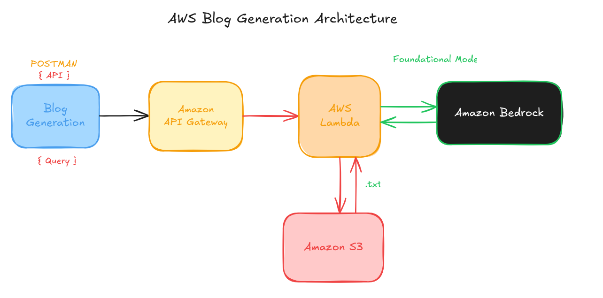

this is a very simple blog generation application but here i have used aws lamda , aws-API-gateway , aws-bedrock

i hace also added boto3-layer.zip as i have used the conversapi  for accessing bedrock , as it is new it is better te add a layer of the imports you might need like pandas or numpy . i also added boto3 because for the issue i told before but there also have been problems with boto3 version preinstalled in lambda

the code have to be copypasted in aws lamda , i have used lambda as i dont have to to all the manual work on starting an ec2 and the configuring all thing , also lambda is better and more easier for scaling also , then used api to hit the lambda function which can talk to bedrock for generation of blog and s3 for saving it all in txt format 

in these appplication proper tinmeout should be put as api calls and all need some time

here is the url you can test on 
curl -X POST https://td6itg1i4b.execute-api.us-east-1.amazonaws.com/dev-env/blog-generation \
  -H "Content-Type: application/json" \
  -d '{"blog_topic": "AI in healthcare"}'

or

 you can do it using postman or https://hoppscotch.io/ 